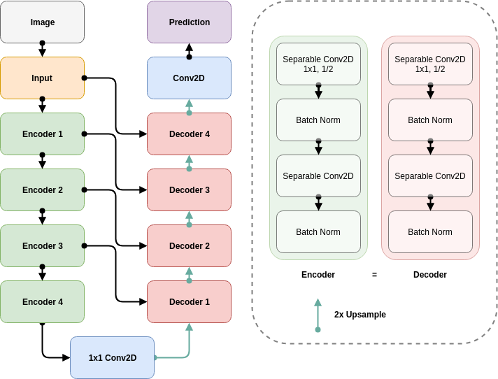

# Project : Deep Learning Quadrotor Follower

In this project, I built a sementic segmentation network with an FCN; the aim was to control a quadrotor in a simulated urban environment to follow a target among a dense crowd.

See the [Youtube Video](https://youtu.be/HBVXjhB7Al4) for the implementation in action.

## Network Architecture

See [here](figs/raw_network.png) for the raw figure generated by keras; the following is a more friendly hierarchical diagram.



The network followed a standard setup of an hourglass network composed of encoding and decoding stages,
with skip connections in between to utilize high-information features at earlier layers. In doing so, it mostly followed the provided template.

Each encoder block was composed of a single 1x1 convolution with half of the output filter size for efficiency,
followed by another separable convolution with 3x3 kernels with the respective output filter size.

Each decoder block was composed of a 2x upsampled previous layer concatenated with the larger input from earlier encoding stages,
followed by two-step separable convolutions similar to the encoder block. In fact, the processes are identical apart from the inputs.

At whole, the network is a series of four encoder blocks, followed by a 1x1 convolution for the "final" representation, then four decoder blocks and the last convolutional layer that provides the output classification through the softmax activation. It ended up being a fairly deep network, and provded to be powerful yet speedy enough to work well for the project.

### Batch Normalization

### Separable Convolution

Depthwise Separable Convolutions are 

### 1x1 Convolution


## Network Tuning

As this was a fairly simple network, only a handful of parameters (apart from the architecture itself) required tuning.

### Hyperparameters

In the final training session of the model, I used the following set of hyperparameters:

| Parameter         | Value |
|:-----------------:|:-----:|
| Learning Rate     | 1e-3  |
| LR Decay          | 2e-4  |
| Batch Size        | 32    |
| Epochs            | 50    |
| Epoch Steps       | 100   |
| Validation Steps  | 50    |
| Workers           | 4     |
| Dropout           | 0.2   |
| L2 Regularization | 1e-4  |

### Learning Rate

The ballpark learning rate was set to be about 1e-3 from experience. However, instead of a fixed learning rate, the learning rate was decayed over time in order to promote stability and convergence.

Keras supports the following decay scheme by default:

```python
lr = lr0 * (1. / (1. + decay * n))
```

Where n is the total update steps from the beginning.
Accordingly, the decay was determined as;

```python
total_steps = steps_per_epoch * num_epochs
lr_decay = (1.0 / 0.5 - 1.0) / total_steps
```

Or 2e-4, in order to anneal the learning rate from 1e-3 to half (5e-4) by the end.

### Batch Size

The batch size was determined partly based on experience; batch size of 32 proved sufficiently effective in mitigating the effects of determining the gradient from a small number of observed sample from a step, while maintaining the speed benefits of not having to iterate over the entire training set.

### Epochs

In terms of the model training, what is really critical is the total number of steps, i.e. the number of epochs multiplied by the number of steps in each epoch.

As far as monitoring progress goes, I decided that it is sufficient to look at the results every 100 steps. Based on the runs it seemed that the network converged rather quickly (compared to some of the other architectures); I set the total steps to 5000 for a bit of leeway. The number of epochs were determined accordingly.

### Regularization

Based on the initial runs, there was strong evidence of the network overfitting to the training samples.

In order to mitigate this issue, I introduced 0.2 dropout in the final encoding after the 1x1 convolution, as well as l2 regularization to all of the trainable parameters in each convolution stages.

However; too strong of a regularization (1e-3) proved to slow down learning and hurt the performance of the model. After twiddling with the term for a bit, I settled with 1e-4.

This way, the network learned to better generalize to the samples, rather than rote memorizization of the training samples.

### Results


After tuning the network, the final score was `0.474` with a validation loss (without regularization) of `0.0291`. Note that the training curve is quite stable.

## Future Enhancements